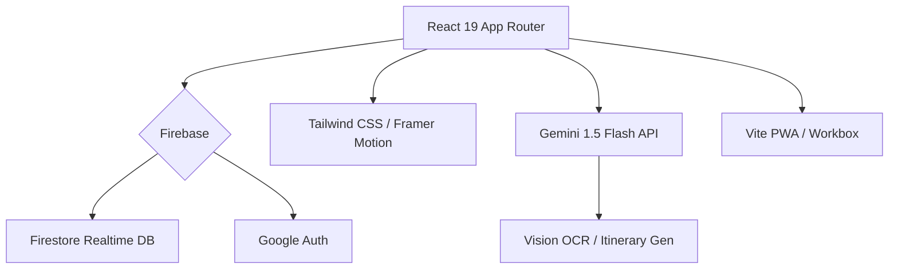

# Travel Together V2 <kbd>V1.9.10</kbd>

> **智能旅遊規劃助手** - 專為多人協作設計。支援即時同步、AI 行程建議與 PWA 離線使用。

### 🚀 V1.9.10: Navigation Hotfix (2026-01-26)
**V1.9.10: [Hotfix] 導航邏輯緊急修復！**
修復了從公開行程視圖 (Public View) 切換時可能導致的路由循環 (Navigation Throttling) 問題，提升頁面切換的穩定性。

### 🌟 V1.9.10 主要更新
1.  **Navigation Guard**: 在 `App.jsx` 加入路由守衛，防止 URL Sync 邏輯與公開行程視圖發生衝突。
2.  **Performance Fix**: 消除因路由衝突導致的重複渲染與瀏覽器警告。

### 🚀 V1.9.9: PWA Polish & Gold Master (2026-01-26)
**V1.9.9: [Gold Master] 1.9 系列最終章與 PWA 體驗打磨！**
為私人行程加入公開「預覽模式 (Preview Mode)」，修復路由邏輯，並確保 PWA 在各平台的穩定性，標誌著 V1.9 系列的完美收官。

### 🌟 V1.9.9 主要更新
1.  **Preview Mode Banner**: 公開行程預覽視圖加入醒目 Banner，明確區分預覽與真實視圖。
2.  **Robust Routing**: 全面重構 URL 路由邏輯 (`/trip/public/:id`), 解決 ID 誤判問題。
3.  **Error Diagnostics**: 強化 `PublicTripView` 錯誤顯示，區分 404 (Not Found) 與 403 (Permission Denied)。
4.  **Weather Stability**: 修復 TripCard 因不完整天氣數據導致的崩潰。

### 🚀 V1.9.8: Stability & Public Polish (2026-01-26)
**V1.9.8: [Stability] 穩定性與體驗微調！**
解決了頁面刷新重導問題，並為私人行程加入了公開預覽按鈕。

### 🌟 V1.9.8 主要更新
1.  **Public Preview**: 私人行程頁面新增「地球」按鈕，一鍵預覽公開效果。
2.  **Redirect Fix**: 徹底修復刷新頁面時錯誤回到 Dashbaord 的問題。
3.  **i18n Fix**: 修正行程篩選器 (Filter) 偶發的翻譯失效。

### 🚀 V1.9.7: UI Unification & Public Improvements (2026-01-23)
**V1.9.7: [UI/UX] 介面大一統與公開行程體驗升級！**
統一了私人與公開行程的 Hero Header 設計，並解決了公開行程資料顯示與崩潰問題。

### 🌟 V1.9.7 主要更新
1.  **Unified Hero Header**: 私人行程引入與公開行程一致的全螢幕 Hero Header，視覺體驗更具沉浸感。
2.  **Public View Fix**: 修復公開行程頁面 (Public Trip View) 資料載入問題，正確顯示 Itinerary 與 Weathr。
3.  **Owner Duplicate**: 行程擁有者現在可以 "Duplicate" (複製) 自己的行程，而非 Fork。
4.  **Crash Fix**: 修復 TripDetailContent 因語法錯誤導致的 500 崩潰。

### 📄 V1.9.4 特性更新 (Stability)
- **Route Fix**: 修復 `/trip` 路由問題，自己嘅行程會正確顯示完整功能。
- **i18n Completion**: 完善 zh-HK 所有勳章翻譯 (20+)，Level/XP 顯示正常。
- **UI Restore**: 公開行程頁面恢復 Header 與 Footer。

### 📄 V1.9.3 特性更新 (Badge Polish)
- **Stability Fix**: 修復 Public Trip View 崩潰問題，確保行程資料正確載入。
- **Badge Localization**: 徽章名稱與描述全面支援繁體中文 (HK) 與英文切換。
- **XP Progress**: 修正等級進度條顯示邏輯，精準反映升級進度。

### 📄 V1.9.0 特性更新 (Social Revolution)
- **Social Profile UI**: 全新 Grid 佈局個人頁面，完美對齊足跡、相簿與勳章，並加入動態等級顯示。
- **Fork System**: 實裝「複製行程」功能，一鍵將公開行程 Deep Clone 到自己帳戶。
- **Localization Audit**: 全面修復 Budget Chart 與 i18n 翻譯遺漏，支援中英雙語完美切換。
- **Public Trip**: 強化公開行程預覽體驗，加入 Fork 按鈕與瀏覽數統計。

### 📄 V1.8.3 特性更新 (Documentation & PWA)
- **文檔全面升級**：新增 `FAQ` 至 6 大項，涵蓋 PWA 安裝、安全性與協作上限。
- **技術架構文檔**：新增 `.agent/docs/` 目錄，包含架構圖與開發規範。
- **PWA 安裝指引**：在 README 中加入詳細的安裝與離線使用教學。

### 🛡️ V1.8.2 特性更新 (Aesthetic Unification)
- **Indigo Glass 視覺統一**：全域應用最新設計語言，優化按鈕、卡片與背景質感。
- **PWA 體驗強化**：同步 Slate-950 主題色，優化啟動頁面 (Splash) 與 Loading 動畫。
- **Firebase 安全優化**：修復元數據同步報錯，增強應用程式穩定性。

## 🚀 V1.8.1: Export Modal & UI Polish (2026-01-21)
**V1.8.1: [Stability & UI] 執位器功能完善與登入頁優化！**
專注於 Export Modal 的頁碼準確度、穩定性，以及 Landing Page 的視覺呈現。

### 🌟 V1.8.1 主要更新
1.  **Dynamic Pagination**: 跨分頁（含附錄）實作動態頁碼追踪，確保 PDF 預覽與匯出頁碼絕對準確。
2.  **Premium Landing Page**: 全面重構登入前頁面，新增 **Comparison (舊做法 vs 新做法)**、**Pricing (資費方案)** 及 **FAQ (常見問題)**，大幅提升視覺質感與轉換率。
3.  **UI Polish**: 修正登入頁垂直居中問題，視覺更平衡。
4.  **Stability Fix**: 解決 `pagedItems` 初始化時序導致的 ReferenceError 崩潰。
5.  **Vercel Deployment**: 優化 `.npmrc` 配置，解決 `npm ci` 在 Vercel 環境下的依賴衝突問題。

---

## 🚀 V1.8.0: Performance Audit & Optimization (2026-01-21)
**V1.8.0: [Optimization] 全面效能審計與懶載入架構！**
專注於渲染效能優化與資源載入策略。

### 🌟 V1.8.0 主要更新
1.  **Global Lazy Loading**: 實施全域延遲加載策略，進一步優化 LCP。
2.  **Vite Chunk Optimization**: 優化 Build 策略，提升快取命中率。
3.  **Render Stability**: 修復 `App.jsx` 渲染結構，解決邏輯回歸問題。

---

## 🚀 V1.7.6: Pro Editor Robustness (2026-01-21)
**V1.7.6: [Fix] 執位器穩定性與 UI 優化！**
修復 SmartExportModal 500 錯誤，引入智能配圖。

---

## 🚀 V1.7.0: PDF Preview & Feature Expansion (2026-01-21)
**V1.7.0: [Feature] PDF 預覽編輯與功能擴展！**
新增 5 種 PDF 樣式預覽、Word-like 行內編輯與拖拽排序。

---

## 🚀 V1.6.0: Advanced Performance & Polish (2026-01-16)
**V1.6.0: [Optimization] 網站效能與體驗的極致打磨！**
專注於網站加載速度 (Performance) 與 SEO 優化，引入了 Lazy Loading 與動態 Meta Tags，並完善了新手教學流程。

### 🌟 V1.6.0 主要更新
1.  **Code Splitting**: 將大型 Modals (PDF, AI, Import) 轉為 Lazy Load，大幅減少首屏 Bundle Size。
2.  **SEO Infrastructure**: 引入 `react-helmet-async` 與 `sitemap.xml`，提升搜尋引擎可見度。
3.  **UX Polish**: 全新 Landing Page、Loading Skeletons 與 PWA Icon 更新。
4.  **Interactive Tutorial**: 完善了新手引導 (`driver.js`)，從建立行程到邀請成員手把手教學。

---

## 🚀 V1.3.1: Jarvis Resurrection (2026-01-08)
**V1.3.1: [Feature] Jarvis AI 全面回歸！**
Jarvis 帶著更強大的功能回歸！重啟了全域對話、智能匯入與全新的行程生成功能。

### 🌟 V1.3.1 主要更新
1.  **AI Trip Gen**: 新增「AI 智能生成」按鈕，一鍵規劃全旅程 (Itinerary + Budget)。
2.  **Global Chat**: Jarvis 聊天視窗回歸，並加入 Local FAQ 快答以節省 API 用量。
3.  **Smart Import**: 重新啟用 Vision API，支援單據與行程截圖識別。

---

## 🚀 V1.3.0: Localization & Onboarding (2026-01-07)
**V1.3.0: [Stable] 穩定性與本地化更新**
專注於多語言體驗與新手引導流程的修復。

### 🌟 V1.3.0 主要更新
1.  **Localization**: 全面修正城市名與 UI 翻譯 (zh-HK/zh-TW)。
2.  **Onboarding**: 修復 UniversalChat 導致的導覽目標丟失問題。
3.  **UI Polish**: 修復 Badges 顯示與 Tutorial 流程。

---

## 🚀 V1.2.25: Desktop Simulation Fix (2026-01-09)
**V1.2.25: [Fix] 桌面版模擬模式 Chat Button 修復！**
修復了桌面版模擬模式中，聊天 FAB 不可見的問題。

### 🌟 V1.2.25 主要更新
1.  **Bug Fix**: 修正 `GlobalChatFAB` 在模擬模式下的渲染條件。
2.  **Logic Fix**: 確保 `isChatOpen` 狀態正確傳遞至 Header。
3.  **Enhancement**: 未登入用戶現在也可在模擬模式使用聊天按鈕。

---

## 🚀 V1.2.24: Simulation Chat Implementation (2026-01-09)
**V1.2.24: [模擬模式] 群聊功能實裝！**
模擬模式而家支援完整的群聊介面，顯示 23 條地道廣東話模擬對話。

### 🌟 V1.2.24 主要更新
1.  **模擬 Chat**: 䃒「閒聊」按鈕會開 UniversalChat 面板。
2.  **地道對話**: 顯示 23 條地道廣東話模擬訊息。
3.  **友善提示**: 模擬模式發訊息時顯示教學提示。
4.  **安全性**: 模擬模式不會嘗試連接 Firebase。

---

## 🚀 V1.2.10: [Archived] Localization Audit (2026-01-07)
**V1.2.10: [i18n] 全站語言審計與修正！**
深度審計 TripHeader 等組件，移除硬編碼字串。

---

## 🚀 V1.2.8: Jarvis Keys & i18n Expansion (2026-01-07)
**V1.2.8: [AI & i18n] 自訂金鑰管理與廣東話 (Cantonese) 支援！**
引入了強大的 Jarvis Keys 管理系統，支援多金鑰輪換，並擴展語系至廣東話。

### ✨ V1.2.8 核心更新 (Updates)
- **🤖 Jarvis Keys (BYOK)**: 實裝自訂 API 金鑰系統，支援 OpenAI, Gemini, Claude 等多供應商管理。
- **🔄 Multi-Key Support**: 每個供應商可新增多把金鑰，支援 Primary 標記與自動輪換邏輯。
- **🇭🇰 廣東話 (zh-HK)**: 新增廣東話語系支援，體驗「兩文三語」完整在地化。
- **📱 Mobile UX**: 優化手機版選單，新增「模擬例子」快捷入口。
- **🎨 Tag UI**: 全面翻新行程分類 Tag 視覺，根據各類別主題色自動渲染，提升視覺層次感。

## 🚀 V1.8.5: UX Hotfixes (2026-01-22)
**V1.8.5: [Stability] 登入穩定性與交互修復！**
緊急修復了 Landing Page 無反應按鈕，以及優化了登出時的權限處理機制。

### ✨ V1.8.5 核心更新 (Updates)
- **🔧 COOP Headers**: 修正 `vite.config.js` Header 設定，解決 Google Login Popup 被瀏覽器攔截問題。
- **🖱️ Landing UX**: 修復 Dashboard Mockup Play Button 無法點擊的問題。
- **🛡️ Auth Logic**: 修正 `Logout` 流程中的 Permission Denied 錯誤，增加 Auth Guard 與 Memory Clean 機制。
- **⚡ Core Optimization**: 優化 Metadata Listener 觸發條件，減少不必要的讀取請求。

## 🚀 V1.8.4: Audit Fixes & Polish (2026-01-22)
**V1.8.4: [Quality] 代碼審計修復與 PWA 優化！**
修復了深層代碼問題，移除遺留日誌，並修正了 PWA 介面在不同裝置上的顯示問題。

### ✨ V1.8.4 核心更新 (Updates)
- **🛠️ Code Hygiene**: 移除大量 `console.log`，提升生產環境潔淨度。
- **📱 UI Polish**: 修復 `TourOverlay` Z-Index 過高與 `OfflineBanner` 位置寫死問題。
- **🛡️ Audit Fixes**: 修正 i18n JSON 語法錯誤，確保翻譯檔結構正確。
- **🇭🇰 i18n**: 完善 zh-HK 翻譯文件結構。

## 🚀 V1.8.3: Aesthetic Unification & Docs (2026-01-22)
**V1.2.7: [UI/UX] 跨視境全域搜尋與多國語系版本正式上線！**
強化了應用的全球化能力，引入 Command+K 全域搜尋與多引擎 AI 支援。

### ✨ V1.2.7 核心更新 (Updates)
- **🌍 多國語系**: 實裝 i18next，支援中英雙語 (zh-TW / en) 切換與自動偵測。
- **🔎 Command+K**: 全域智慧搜尋與操作麵盤，實現「一鍵達」跨行程操作。
- **🤖 AI Multi-Provider**: 支持 OpenAI (GPT), Claude, DeepSeek, Groq, Perplexity 與本地 LLM。
- **🎨 語義色系 2.0**: 重新設計的分類色彩系統，確保跨 6 大視圖的一致視覺體驗。
- **🗺️ 統計數據**: 地圖面板新增總距離與站點分析，掌握行程規模。

## 🚀 V1.2.6: The Ultimate View (2026-01-07)
**V1.2.6: [Multi-View] 多維視界與 Pinterest 瀑布流！**
引入 "6-in-1" 多維度行程檢視模式，支援 Kanban (Trello)、Timeline (Notion) 與 Map Playback (Mapbox) 視角。

### ✨ V1.2.6 核心更新 (Updates)
- **👁️ 多維視界**: 全新 6-in-1 多視圖系統 (List | Board | Kanban | Timeline | Map)。
- **📌 Pinterest 視圖**: 瀑布流佈局呈現行程項目 (Social Ready)。
- **📊 Kanban 視圖**: 看板式拖放管理所有日程。
- **🔍 全域搜尋**: Search & Filter 現支援所有視圖模式。
- **📅 Compact Header**: 日期+視圖切換+操作按鈕合併為單行。
- **👀 可視度提升**: List/Map 視圖加入背景模糊與對比度優化。
- **🧹 程式碼精簡**: 移除 160+ 行冗餘代碼。

## 🚀 V1.2.5: Architecture & Stability (2026-01-07)
**V1.2.5: [Tech] 架構重構與用戶體驗優化！**
本次更新專注於代碼架構優化、跨裝置設定同步，以及帳戶管理功能。

### ✨ V1.2.5 核心更新 (Updates)
- **🏗️ Layout Refactor**: TripDetailContent 拆分為 TripHeader / TripTabs / TripModals 組件。
- **👤 帳戶管理**: 新增個人資料編輯、設定同步 (跨裝置)、刪除帳戶功能。
- **🌐 離線偵測**: 離線時自動提示用戶，防止同步失敗。
- **📊 AI 用量修復**: 功能使用明細現已正確顯示各項 AI 功能的使用次數。
- **🔄 Admin 每日重置**: API Monitor 計數器現會按日期自動重置。
- **🎨 UI 一致性**: 設定頁面所有分頁現已統一顯示圖標。

## 🚀 V1.2.4: Intelligent Onboarding & PWA Polish (2025-12-24)

## 🚀 V1.2.3: Social & AI Quota Control (2025-12-23)
**V1.2.3: [Social & AI] 用戶級 AI 配額與隱私監控！**
本次更新引入了 Granular Quota Tracking，為每位用戶提供獨立的 AI 使用額度，並大幅提升系統整體的 AI 承載能力。

### ✨ V1.2.3 核心更新 (Updates)
- **🔒 Per-User Quota**: 實裝 Firestore 用戶級計費，精準追蹤每一項 AI 功能的 Token 消耗。
- **🔑 Enhanced Capacity**: 系統後端架構升級，大幅提升 AI 服務的穩定性與可用額度。
- **🛡️ Privacy Monitor**: 新增 Admin Console 監控面板，以保護隱私的方式顯示系統健康度 (System Pool Status)。
- **💬 Auto-Jarvis Control**: 設定頁新增 "Auto Jarvis" 開關，用戶可自由選擇是否啟用 AI 自動化功能。

## 🚀 V1.2.2: Jarvis AI Support Center (2025-12-23)
**V1.2.2: [AI Support] Jarvis AI 視覺介面與支援中心先行版！**
本次更新實裝了 Jarvis AI 的專屬客服入口與高質感視覺介面。

### ✨ V1.2.2 核心更新 (Updates)
- **🤖 Jarvis Visual Integration**: 實裝專屬 AI 客服介面，包含毛玻璃 Avatar 效果與動態光環感。
- **💬 Smart Interaction**: 加入 Smart Hints 快速查問功能，為 Jarvis AI 回答邏輯奠定基礎。
- **⚡ Pulse Animations**: 加入 `pulse-slow` 呼吸燈特效，強化 AI 助手的科技存在感。

## 🚀 V1.2.1: User Group Chat (2025-12-23)
**V1.2.1: [Social] 行程即時群聊功能正式實裝！**
行程成員現在可以直接在 App 內溝通，無需切換至其他通訊軟體。

### ✨ V1.2.1 核心更新 (Updates)
- **💬 Real-time Chat**: 整合 Firestore `onSnapshot` 監聽，實現毫秒級訊息同步。
- **📱 Glassmorphism Drawer**: 精美的手機側滑聊天抽屜，支援深色模式與即時頭像顯示。
- **🔔 Live Notifications**: 呼吸燈式 Chat Button，動態提示聊天室口有新訊息/活躍中。

## 🚀 V1.1.8: Dark Mode & AI Polish (2025-12-23)
**V1.1.8: [Visual & Stability] Dark Mode 全面回歸 + AI 韌性強化！**
**V1.1.7: [Daily Intelligence] 每日總覽智能化 + 匯出預覽升級！**
本次更新專注於「每日行程」的深度分析，引入 AI 每日總覽功能，並大幅強化匯出預覽體驗，支援全格式的全螢幕預覽。

### ✨ V1.1.7 核心更新 (Updates)
- **🧠 Daily AI Analysis**: 「每日總覽」實裝 AI 分析按鈕，一鍵生成當日交通建議、行程合理性分析與貼心 Tips (Gemini 1.5 Flash)。
- **📄 PDF Pagination**: 匯出引擎支援智能分頁，根據設定 (Items Per Page) 自動切割行程並加入頁碼。
- **👁️ Enhanced Previews**: 匯出預覽支援「JSON / Text / iCal」全螢幕放大查看 (Full View)，並優化文字顯示清晰度。
- **🐞 Core Fixes**: 修復 ai-parsing 語法錯誤及 Modal 重複代碼，提升穩定性。

## 🚀 V1.1.2: Audit & Precision (2025-12-23)
**V1.1.2: [Logic & Workflow] 全面審計與匯出精準化！**
本次更新實裝了行程匯出的「範圍選擇」(Scope)，讓你可以單獨匯出購物清單或預算記錄，不再需要強行帶上整個行程。同時引入了 AI Agent 代碼審計工作流。

## 🚀 V1.1.0: Ticket Style & Smart Connections (2025-12-21)
**V1.1.0: [Design & Intelligence] 行程管理極致進化！**
全新「票券式」卡片設計 (Ticket Style)，配備 Google Maps 實時交通預測與一鍵生成連接，讓你的旅遊規劃充滿質感。

### ✨ V1.1.0 核心更新 (Updates)
- **🎨 Ticket Style Unification**: 所有卡片統一為「機票/票券」設計，左右佈局 + 圓角裁切，極具仪式感。
- **🗺️ Google Maps Integration**: 景點間自動計算步行/交通路徑與時間，一鍵將建議加入行程。
- **🌙 Late Night Logic**: 特優化 00:00-05:00 行程排序與「返回酒店」捷徑，完美支援深夜生活。
- **🔄 Undo/Redo System**: 回復與重做功能，修改行程唔驚手殘。
- **🛡️ Dependencies Upgrade**: Firebase 11.x & Vite 6.x 安全升級。

## 🚀 V1.0.4: Optimistic UI & Data Integrity (2025-12-21)
**V1.0.4: [Optimistic UI] 極速行程管理體驗！**
引入 Optimistic UI 技術，實現「0 延遲」行程新增、編輯與刪除。即使網絡不穩，操作亦即時反饋並由後台自動同步。

### ✨ V1.0.4 核心修復 (Fixes & Features)
- **⚡ Optimistic UI**: Create/Edit/Delete 操作即時已更新 UI，無需等待 Firebase 回傳 (0ms latency)。
- **🛡️ Data Integrity**: 修復 ID 衝突漏洞，加入 LocalStorage 雙重備份，確保刷新頁面後未同步數據不丟失。
- **🗺️ Live Map Sync**: 地圖視圖與列表視圖實時同步，刪除項目後地圖 Pin 即時消失。
- **🐛 Critical Fixes**: 修復 `undefined` 字段錯誤、編輯變新增問題、刪除卡死問題。

## 🚀 V1.0.3: Immigration & PWA Matrix (2025-12-21)
**V1.0.3: [Immigration System] 入境程序全面智能化！**
專為國際航班打造的入境程序卡片，配合 Dashboard Widget 個人化系統，讓旅程管理更貼心。

---

## 🚀 V1.0.2: Zero-Loop Fix & Guest Mode (2025-12-21)
**V1.0.2: [Zero-Loop Fix] 遊客模式終極修復！**
徹底解決了遊客模式下的無限重載 (Redirect Loop) 與 WebSocket 錯誤。加入了全新的 **"Try Demo"** 入口，無需登入即可一鍵體驗完整教學模式。

### ✨ V1.0.2 核心修復 (Fixes)
- **🐛 Critical Fix**: 修復遊客模式無限 Loop 及 `null` 引用崩潰。
- **⚡️ Performance**: 清除殘留伺服器進程，解決 WebSocket 連接錯誤。
- **🛡️ Null Safety**: 全面強化 `ActiveUsersList` 與 Modals 的防錯機制。
- **🖱️ UX Upgrade**: Landing Page 新增醒目「試用模擬模式」按鈕。

## 🚀 V1.0.1: Matrix & Encyclopedia Sync (2025-12-21)
**V1.0.1: [Matrix Protocol] 最終爆發同步！**
這是一次內容與邏輯的深度同步，確保教學範例與數據結構達成 100% 匹配。我們引進了極致細節的「導航矩陣」與「全員角色任務」。

### ✨ V1.0.1 核心更新 (Updates)
- **🚀 Matrix Protocol**: 補足所有行程空檔 (如 Day 6 千日前)，達成 0 死角導航矩陣。
- **📚 Encyclopedia Content**: 深入挖掘 Senso-ji, USJ, W Osaka 等地標的建築與歷史背景。
- **👥 Per-Person Metadata**: 每一項行李、預算與購物任務均分配至具體成員。
- **🐛 Loop Bug Fix**: 徹底修復非會員無法進入教學模式的程式邏輯問題。

## 🚀 V1.0.0: The Intelligent Era (2025-12-20)
**Travel Together V1.0 正式發布！**
這是一次從 UI 到核心架構的全面進化。我們為現代多人旅遊帶來了極致流暢的體驗，集成了 **Google Gemini AI 視覺識別**、**PWA 離線模式** 與 **Design System 2.0** 玻璃擬態設計。

### ✨ V1.0 核心亮點 (Highlights)
- **🎨 Design System 2.0**: 全新 **Indigo Glass** 設計語言，採用各種深度的毛玻璃效果、微互動動畫 (Micro-interactions) 與 iOS 原生級的 Slide Up 轉場。
- **📱 Mobile First & PWA**: 完美支援 iOS/Android PWA 安裝，配備全新底部導航欄與 Safe Area 適配，離線亦可查看行程。
- **🤖 Vision-First AI**: 唔使打字！直接影相識別機票、酒店單據或收據，AI 自動填入行程表與預算分帳。
- **🛡️ Enterprise Security**: 內置 Rate Limiting (防濫用)、Autoban System (智能封鎖) 與 Firestore 自動同步，確保資料絕對安全。

---

## 📽️ 概覽 (Overview)
**Travel Together** 是一個智能化協作平台，解決傳統旅遊規劃的痛點：分散的資訊、混亂的記帳與繁瑣的輸入。

---

## 🔥 功能全覽 (Features)

### 🤖 AI 智能領隊 (AI Guide)
- **Gemini Vision**: 拖入截圖/照片，自動識別航班、酒店、景點資訊。
- **智能交通**: 自動計算點對點交通方式 (地鐵/Uber/步行)，並提供真實票價。
- **智能打包**: 根據目的地天氣與活動 (如滑雪、米芝蓮)，自動生成專屬行李清單。

### 🎨 極致體驗 (UX/UI)
- **Glassmorphism 2.0**: 現代感極強的半透明介面，適配深色模式 (Dark Mode)。
- **Skeleton Loading**: 絲滑的加載體驗，告別白屏等待。
- **Onboarding**: 新手引導模式，30 秒學會所有功能。

### 💰 財務與協作 (Budget & Collab)
- **多幣種分帳**: 即時匯率換算，支援匯出報表。
- **實時同步**: 多人同時編輯，毫秒級同步 (Firebase Realtime)。
- **債務結算**: 一鍵計算 "Who owes who"，支援匯出報表。

### 📊 旅遊資訊中心 (Info Hub)
- **實時 Widget**: 整合當地天氣、匯率、新聞、機票優惠與電壓資訊。
- **Smart Widgets**: 自動偵測你是否在旅途中，顯示當前城市資訊。

---

## 🛠️ 技術架構 (Tech Stack)

---

## 📋 版本紀錄 (History)

| **V1.9.10** | **Navigation Hotfix** | 🚀 最新版 |
| **V1.9.9** | **PWA Polish & Gold Master** | ✅ 已發布 |
| **V1.9.8** | **Stability & Public Polish** | ✅ 已發布 |
| **V1.9.7** | **UI Unification & Public Improvements** | ✅ 已發布 |
| **V1.9.0** | **Social Revolution** | ✅ 已發布 |
| **V1.8.1** | **Export Modal & UI Polish** | ✅ 已發布 |
| **V1.5.2** | **Local Trip Logic** | ✅ 已發布 |

---

---

## 🚀 快速開始 (Quick Start)

1. **Clone**: `git clone https://github.com/JackoV416/travelTogether2.git`
2. **Install**: `pnpm install`
3. **Setup**: 複製 `.env.example` 到 `.env`，填入 Firebase & Gemini Key
4. **Run**: `pnpm dev`
5. **Build**: `pnpm build`

---

## 📱 PWA 功能與安裝指引 (Installable App)

Travel Together 2 採用 PWA 技術，您可以將網站安裝至手機主畫面，獲得接近原生 App 的體驗：

1. **iOS (Safari)**: 點擊瀏覽器下方的「分享」按鈕，選擇「加入主畫面」。
2. **Android (Chrome)**: 點擊網址列右側的「安裝」圖示，或在選單中選擇「安裝應用程式」。
3. **Desktop (Chrome/Edge)**: 網址列右側會出現安裝圖示。

### PWA 優勢：
- **離線查看**：即使在飛機上或沒有 SIM 卡的地區，也能查看已同步的行程。
- **快速啟動**：無需經由 App Store，秒開即用。
- **沉浸式體驗**：無網址列遮擋，全螢幕設計。

## 🛡️ 安全性與穩定性 (Security & Hardening)

我們非常重視您的數據安全：
- **SafeChat™ 端對端身份保護**：基於 Firebase 的訊息傳輸均經過加密處理。
- **Firestore 鐵壁規則**：嚴格的 Security Rules 確保只有行程成員能存取數據。
- **Listener Hardening**：V1.8.2/1.8.3 引入了全域監聽器加固，徹底解決 HMR 崩潰與權限報錯問題。

## 📖 技術文檔 (Developer Docs)

- [System Architecture](file:///Users/jamiekwok/Documents/GitHub/travelTogether2/.agent/docs/architecture.md)
- [Coding Conventions](file:///Users/jamiekwok/Documents/GitHub/travelTogether2/.agent/docs/conventions.md)
- [Version History](file:///Users/jamiekwok/Documents/GitHub/travelTogether2/.agent/backlog/version_roadmap.md)

---

**Author**: [Jamie Kwok](https://github.com/JackoV416)
**Last Updated**: 2026-01-22
