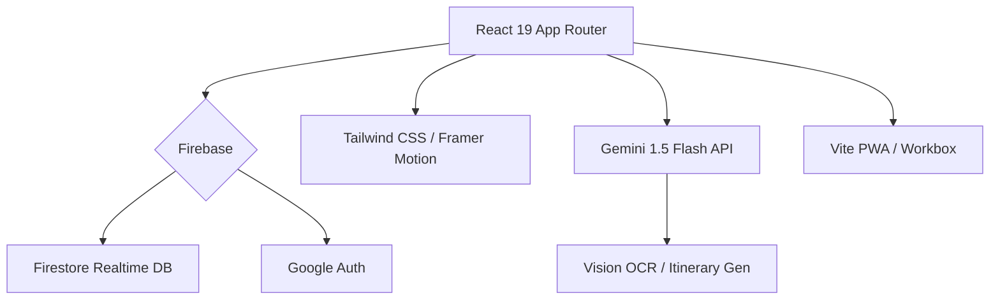

# Travel Together (智能旅遊規劃) V1.0.5

## 🚀 V1.0.5: Security Update (2025-12-21)
**V1.0.5: [Security] 核心依賴全面升級！**
為確保系統長遠安全與穩定，我們將核心依賴 (Firebase/Vite) 升級至最新版本，並修復了所有已知的 `npm audit` 漏洞。

### ✨ V1.0.5 核心更新 (Updates)
- **🛡️ 漏洞修復**: 解決 12 個 `moderate` 級別安全漏洞 (主要涉及 `esbuild` 與 `undici`)。
- **📦 依賴升級**:
    - **Firebase**: `v10.x` ➔ `v11.x`
    - **Vite**: `v5.x` ➔ `v6.x`
- **🔧 穩定性驗證**: 通過完整的 Build 與 Runtime 測試，確保新版本兼容性。

## 🚀 V1.0.4: Optimistic UI & Data Integrity (2025-12-21)
**V1.0.4: [Optimistic UI] 極速行程管理體驗！**
引入 Optimistic UI 技術，實現「0 延遲」行程新增、編輯與刪除。即使網絡不穩，操作亦即時反饋並由後台自動同步。

### ✨ V1.0.4 核心修復 (Fixes & Features)
- **⚡ Optimistic UI**: Create/Edit/Delete 操作即時已更新 UI，無需等待 Firebase 回傳 (0ms latency)。
- **🛡️ Data Integrity**: 修復 ID 衝突漏洞，加入 LocalStorage 雙重備份，確保刷新頁面後未同步數據不丟失。
- **🗺️ Live Map Sync**: 地圖視圖與列表視圖實時同步，刪除項目後地圖 Pin 即時消失。
- **🐛 Critical Fixes**: 修復 `undefined` 字段錯誤、編輯變新增問題、刪除卡死問題。

## 🚀 V1.0.3: Immigration & PWA Matrix (2025-12-21)
**V1.0.3: [Immigration System] 入境程序全面智能化！**
專為國際航班打造的入境程序卡片，配合 Dashboard Widget 個人化系統，讓旅程管理更貼心。

---

## 📽️ 概覽 (Overview)
**Travel Together** 是一個智能化協作平台，解決傳統旅遊規劃的痛點：分散的資訊、混亂的記帳與繁瑣的輸入。

---

## 🔥 功能全覽 (Features)

### 🤖 AI 智能領隊 (AI Guide)
- **Gemini Vision**: 拖入截圖/照片，自動識別航班、酒店、景點資訊。
- **智能交通**: 自動計算點對點交通方式 (地鐵/Uber/步行)，並提供真實票價。
- **智能打包**: 根據目的地天氣與活動 (如滑雪、米芝蓮)，自動生成專屬行李清單。

### 🎨 極致體驗 (UX/UI)
- **Glassmorphism 2.0**: 現代感極強的半透明介面，適配深色模式 (Dark Mode)。
- **Skeleton Loading**: 絲滑的加載體驗，告別白屏等待。
- **Onboarding**: 新手引導模式，30 秒學會所有功能。

### 💰 財務與協作 (Budget & Collab)
- **多幣種分帳**: 即時匯率換算，支援匯出報表。
- **實時同步**: 多人同時編輯，毫秒級同步 (Firebase Realtime)。
- **債務結算**: 一鍵計算 "Who owes who"，支援匯出報表。

### 📊 旅遊資訊中心 (Info Hub)
- **實時 Widget**: 整合當地天氣、匯率、新聞、機票優惠與電壓資訊。
- **Smart Widgets**: 自動偵測你是否在旅途中，顯示當前城市資訊。

---

## 🛠️ 技術架構 (Tech Stack)

---

## 📋 版本紀錄 (History)

| 版本 | 標籤 | 狀態 |
| :--- | :--- | :--- |
| **V1.0.5** | **Security Update** | 🚀 最新版 |
| **V1.0.4** | **Optimistic UI Update** | ✅ 已發布 |
| **V1.0.3** | **Immigration System** | ✅ 已發布 |
| **V1.0.2** | **Zero-Loop Fix** | ✅ 已發布 |
| **V1.0.1** | **Matrix Sync Update** | ✅ 已發布 |
| **V1.0.0** | **Official Release** | ✅ 已發布 |

---

---

## 🚀 快速開始 (Quick Start)

1. **Clone**: `git clone https://github.com/JackoV416/travelTogether2.git`
2. **Install**: `pnpm install`
3. **Setup**: 複製 `.env.example` 到 `.env`，填入 Firebase & Gemini Key
4. **Run**: `pnpm dev`
5. **Build**: `pnpm build`

---

**Author**: [Jamie Kwok](https://github.com/JackoV416)
**Last Updated**: 2025-12-21
