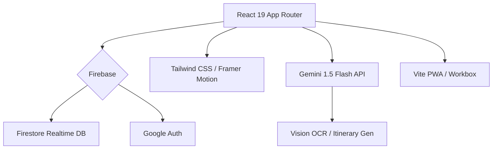

# Travel Together (智能旅遊規劃) V1.2.21

## 🚀 V1.2.21: Tutorial & UX Fixes (2026-01-09)
**V1.2.21: [PWA] 模擬例子「閒聊」按鈕 + UX 修復！**
本次更新修復咗模擬例子嘅閒聊功能同 PWA 介面問題。

### 🌟 V1.2.21 主要更新
1.  **Multi-City Localization**: 強力支援跨城市行程翻譯 (例如：`Kyoto -> Osaka` 自動轉為 `京都 → 大阪`)。
2.  **Currency Summation Fix**: 修復 Itinerary 每日總結的混合幣種計算邏輯，支援即時匯率換算並顯示 HKD 等值。
3.  **Kanban Localization**: Kanban 視圖現支援分日城市標籤，並全面本地化。
4.  **City Database Expansion**: 新增日本（北海道、福岡、沖繩、札幌）及多個全球城市的翻譯與貨幣資訊。
5.  **Critical Bug Fixes**: 修復 `ItineraryTab` 的 `t is not defined`、Helper Shadowing 導致的翻譯錯誤，以及 `VersionModal` 的渲染問題。
6.  **UI Polishing**: 優化地點選擇器語言切換，並確保全站使用統一的本地化 Helper。

---

## 🚀 V1.2.10: [Archived] Localization Audit (2026-01-07)
**V1.2.10: [i18n] 全站語言審計與修正！**
深度審計 TripHeader 等組件，移除硬編碼字串。

---

## 🚀 V1.2.8: Jarvis Keys & i18n Expansion (2026-01-07)
**V1.2.8: [AI & i18n] 自訂金鑰管理與廣東話 (Cantonese) 支援！**
引入了強大的 Jarvis Keys 管理系統，支援多金鑰輪換，並擴展語系至廣東話。

### ✨ V1.2.8 核心更新 (Updates)
- **🤖 Jarvis Keys (BYOK)**: 實裝自訂 API 金鑰系統，支援 OpenAI, Gemini, Claude 等多供應商管理。
- **🔄 Multi-Key Support**: 每個供應商可新增多把金鑰，支援 Primary 標記與自動輪換邏輯。
- **🇭🇰 廣東話 (zh-HK)**: 新增廣東話語系支援，體驗「兩文三語」完整在地化。
- **📱 Mobile UX**: 優化手機版選單，新增「模擬例子」快捷入口。
- **🎨 Tag UI**: 全面翻新行程分類 Tag 視覺，根據各類別主題色自動渲染，提升視覺層次感。

## 🚀 V1.2.7: Global UI Overhaul & Localization (2026-01-07)
**V1.2.7: [UI/UX] 跨視境全域搜尋與多國語系版本正式上線！**
強化了應用的全球化能力，引入 Command+K 全域搜尋與多引擎 AI 支援。

### ✨ V1.2.7 核心更新 (Updates)
- **🌍 多國語系**: 實裝 i18next，支援中英雙語 (zh-TW / en) 切換與自動偵測。
- **🔎 Command+K**: 全域智慧搜尋與操作麵盤，實現「一鍵達」跨行程操作。
- **🤖 AI Multi-Provider**: 支持 OpenAI (GPT), Claude, DeepSeek, Groq, Perplexity 與本地 LLM。
- **🎨 語義色系 2.0**: 重新設計的分類色彩系統，確保跨 6 大視圖的一致視覺體驗。
- **🗺️ 統計數據**: 地圖面板新增總距離與站點分析，掌握行程規模。

## 🚀 V1.2.6: The Ultimate View (2026-01-07)
**V1.2.6: [Multi-View] 多維視界與 Pinterest 瀑布流！**
引入 "6-in-1" 多維度行程檢視模式，支援 Kanban (Trello)、Timeline (Notion) 與 Map Playback (Mapbox) 視角。

### ✨ V1.2.6 核心更新 (Updates)
- **👁️ 多維視界**: 全新 6-in-1 多視圖系統 (List | Board | Kanban | Timeline | Map)。
- **📌 Pinterest 視圖**: 瀑布流佈局呈現行程項目 (Social Ready)。
- **📊 Kanban 視圖**: 看板式拖放管理所有日程。
- **🔍 全域搜尋**: Search & Filter 現支援所有視圖模式。
- **📅 Compact Header**: 日期+視圖切換+操作按鈕合併為單行。
- **👀 可視度提升**: List/Map 視圖加入背景模糊與對比度優化。
- **🧹 程式碼精簡**: 移除 160+ 行冗餘代碼。

## 🚀 V1.2.5: Architecture & Stability (2026-01-07)
**V1.2.5: [Tech] 架構重構與用戶體驗優化！**
本次更新專注於代碼架構優化、跨裝置設定同步，以及帳戶管理功能。

### ✨ V1.2.5 核心更新 (Updates)
- **🏗️ Layout Refactor**: TripDetailContent 拆分為 TripHeader / TripTabs / TripModals 組件。
- **👤 帳戶管理**: 新增個人資料編輯、設定同步 (跨裝置)、刪除帳戶功能。
- **🌐 離線偵測**: 離線時自動提示用戶，防止同步失敗。
- **📊 AI 用量修復**: 功能使用明細現已正確顯示各項 AI 功能的使用次數。
- **🔄 Admin 每日重置**: API Monitor 計數器現會按日期自動重置。
- **🎨 UI 一致性**: 設定頁面所有分頁現已統一顯示圖標。

## 🚀 V1.2.4: Intelligent Onboarding & PWA Polish (2025-12-24)

## 🚀 V1.2.3: Social & AI Quota Control (2025-12-23)
**V1.2.3: [Social & AI] 用戶級 AI 配額與隱私監控！**
本次更新引入了 Granular Quota Tracking，為每位用戶提供獨立的 AI 使用額度，並大幅提升系統整體的 AI 承載能力。

### ✨ V1.2.3 核心更新 (Updates)
- **🔒 Per-User Quota**: 實裝 Firestore 用戶級計費，精準追蹤每一項 AI 功能的 Token 消耗。
- **🔑 Enhanced Capacity**: 系統後端架構升級，大幅提升 AI 服務的穩定性與可用額度。
- **🛡️ Privacy Monitor**: 新增 Admin Console 監控面板，以保護隱私的方式顯示系統健康度 (System Pool Status)。
- **💬 Auto-Jarvis Control**: 設定頁新增 "Auto Jarvis" 開關，用戶可自由選擇是否啟用 AI 自動化功能。

## 🚀 V1.2.2: Jarvis AI Support Center (2025-12-23)
**V1.2.2: [AI Support] Jarvis AI 視覺介面與支援中心先行版！**
本次更新實裝了 Jarvis AI 的專屬客服入口與高質感視覺介面。

### ✨ V1.2.2 核心更新 (Updates)
- **🤖 Jarvis Visual Integration**: 實裝專屬 AI 客服介面，包含毛玻璃 Avatar 效果與動態光環感。
- **💬 Smart Interaction**: 加入 Smart Hints 快速查問功能，為 Jarvis AI 回答邏輯奠定基礎。
- **⚡ Pulse Animations**: 加入 `pulse-slow` 呼吸燈特效，強化 AI 助手的科技存在感。

## 🚀 V1.2.1: User Group Chat (2025-12-23)
**V1.2.1: [Social] 行程即時群聊功能正式實裝！**
行程成員現在可以直接在 App 內溝通，無需切換至其他通訊軟體。

### ✨ V1.2.1 核心更新 (Updates)
- **💬 Real-time Chat**: 整合 Firestore `onSnapshot` 監聽，實現毫秒級訊息同步。
- **📱 Glassmorphism Drawer**: 精美的手機側滑聊天抽屜，支援深色模式與即時頭像顯示。
- **🔔 Live Notifications**: 呼吸燈式 Chat Button，動態提示聊天室口有新訊息/活躍中。

## 🚀 V1.1.8: Dark Mode & AI Polish (2025-12-23)
**V1.1.8: [Visual & Stability] Dark Mode 全面回歸 + AI 韌性強化！**
**V1.1.7: [Daily Intelligence] 每日總覽智能化 + 匯出預覽升級！**
本次更新專注於「每日行程」的深度分析，引入 AI 每日總覽功能，並大幅強化匯出預覽體驗，支援全格式的全螢幕預覽。

### ✨ V1.1.7 核心更新 (Updates)
- **🧠 Daily AI Analysis**: 「每日總覽」實裝 AI 分析按鈕，一鍵生成當日交通建議、行程合理性分析與貼心 Tips (Gemini 1.5 Flash)。
- **📄 PDF Pagination**: 匯出引擎支援智能分頁，根據設定 (Items Per Page) 自動切割行程並加入頁碼。
- **👁️ Enhanced Previews**: 匯出預覽支援「JSON / Text / iCal」全螢幕放大查看 (Full View)，並優化文字顯示清晰度。
- **🐞 Core Fixes**: 修復 ai-parsing 語法錯誤及 Modal 重複代碼，提升穩定性。

## 🚀 V1.1.2: Audit & Precision (2025-12-23)
**V1.1.2: [Logic & Workflow] 全面審計與匯出精準化！**
本次更新實裝了行程匯出的「範圍選擇」(Scope)，讓你可以單獨匯出購物清單或預算記錄，不再需要強行帶上整個行程。同時引入了 AI Agent 代碼審計工作流。

## 🚀 V1.1.0: Ticket Style & Smart Connections (2025-12-21)
**V1.1.0: [Design & Intelligence] 行程管理極致進化！**
全新「票券式」卡片設計 (Ticket Style)，配備 Google Maps 實時交通預測與一鍵生成連接，讓你的旅遊規劃充滿質感。

### ✨ V1.1.0 核心更新 (Updates)
- **🎨 Ticket Style Unification**: 所有卡片統一為「機票/票券」設計，左右佈局 + 圓角裁切，極具仪式感。
- **🗺️ Google Maps Integration**: 景點間自動計算步行/交通路徑與時間，一鍵將建議加入行程。
- **🌙 Late Night Logic**: 特優化 00:00-05:00 行程排序與「返回酒店」捷徑，完美支援深夜生活。
- **🔄 Undo/Redo System**: 回復與重做功能，修改行程唔驚手殘。
- **🛡️ Dependencies Upgrade**: Firebase 11.x & Vite 6.x 安全升級。

## 🚀 V1.0.4: Optimistic UI & Data Integrity (2025-12-21)
**V1.0.4: [Optimistic UI] 極速行程管理體驗！**
引入 Optimistic UI 技術，實現「0 延遲」行程新增、編輯與刪除。即使網絡不穩，操作亦即時反饋並由後台自動同步。

### ✨ V1.0.4 核心修復 (Fixes & Features)
- **⚡ Optimistic UI**: Create/Edit/Delete 操作即時已更新 UI，無需等待 Firebase 回傳 (0ms latency)。
- **🛡️ Data Integrity**: 修復 ID 衝突漏洞，加入 LocalStorage 雙重備份，確保刷新頁面後未同步數據不丟失。
- **🗺️ Live Map Sync**: 地圖視圖與列表視圖實時同步，刪除項目後地圖 Pin 即時消失。
- **🐛 Critical Fixes**: 修復 `undefined` 字段錯誤、編輯變新增問題、刪除卡死問題。

## 🚀 V1.0.3: Immigration & PWA Matrix (2025-12-21)
**V1.0.3: [Immigration System] 入境程序全面智能化！**
專為國際航班打造的入境程序卡片，配合 Dashboard Widget 個人化系統，讓旅程管理更貼心。

---

## 🚀 V1.0.2: Zero-Loop Fix & Guest Mode (2025-12-21)
**V1.0.2: [Zero-Loop Fix] 遊客模式終極修復！**
徹底解決了遊客模式下的無限重載 (Redirect Loop) 與 WebSocket 錯誤。加入了全新的 **"Try Demo"** 入口，無需登入即可一鍵體驗完整教學模式。

### ✨ V1.0.2 核心修復 (Fixes)
- **🐛 Critical Fix**: 修復遊客模式無限 Loop 及 `null` 引用崩潰。
- **⚡️ Performance**: 清除殘留伺服器進程，解決 WebSocket 連接錯誤。
- **🛡️ Null Safety**: 全面強化 `ActiveUsersList` 與 Modals 的防錯機制。
- **🖱️ UX Upgrade**: Landing Page 新增醒目「試用模擬模式」按鈕。

## 🚀 V1.0.1: Matrix & Encyclopedia Sync (2025-12-21)
**V1.0.1: [Matrix Protocol] 最終爆發同步！**
這是一次內容與邏輯的深度同步，確保教學範例與數據結構達成 100% 匹配。我們引進了極致細節的「導航矩陣」與「全員角色任務」。

### ✨ V1.0.1 核心更新 (Updates)
- **🚀 Matrix Protocol**: 補足所有行程空檔 (如 Day 6 千日前)，達成 0 死角導航矩陣。
- **📚 Encyclopedia Content**: 深入挖掘 Senso-ji, USJ, W Osaka 等地標的建築與歷史背景。
- **👥 Per-Person Metadata**: 每一項行李、預算與購物任務均分配至具體成員。
- **🐛 Loop Bug Fix**: 徹底修復非會員無法進入教學模式的程式邏輯問題。

## 🚀 V1.0.0: The Intelligent Era (2025-12-20)
**Travel Together V1.0 正式發布！**
這是一次從 UI 到核心架構的全面進化。我們為現代多人旅遊帶來了極致流暢的體驗，集成了 **Google Gemini AI 視覺識別**、**PWA 離線模式** 與 **Design System 2.0** 玻璃擬態設計。

### ✨ V1.0 核心亮點 (Highlights)
- **🎨 Design System 2.0**: 全新 **Indigo Glass** 設計語言，採用各種深度的毛玻璃效果、微互動動畫 (Micro-interactions) 與 iOS 原生級的 Slide Up 轉場。
- **📱 Mobile First & PWA**: 完美支援 iOS/Android PWA 安裝，配備全新底部導航欄與 Safe Area 適配，離線亦可查看行程。
- **🤖 Vision-First AI**: 唔使打字！直接影相識別機票、酒店單據或收據，AI 自動填入行程表與預算分帳。
- **🛡️ Enterprise Security**: 內置 Rate Limiting (防濫用)、Autoban System (智能封鎖) 與 Firestore 自動同步，確保資料絕對安全。

---

## 📽️ 概覽 (Overview)
**Travel Together** 是一個智能化協作平台，解決傳統旅遊規劃的痛點：分散的資訊、混亂的記帳與繁瑣的輸入。

---

## 🔥 功能全覽 (Features)

### 🤖 AI 智能領隊 (AI Guide)
- **Gemini Vision**: 拖入截圖/照片，自動識別航班、酒店、景點資訊。
- **智能交通**: 自動計算點對點交通方式 (地鐵/Uber/步行)，並提供真實票價。
- **智能打包**: 根據目的地天氣與活動 (如滑雪、米芝蓮)，自動生成專屬行李清單。

### 🎨 極致體驗 (UX/UI)
- **Glassmorphism 2.0**: 現代感極強的半透明介面，適配深色模式 (Dark Mode)。
- **Skeleton Loading**: 絲滑的加載體驗，告別白屏等待。
- **Onboarding**: 新手引導模式，30 秒學會所有功能。

### 💰 財務與協作 (Budget & Collab)
- **多幣種分帳**: 即時匯率換算，支援匯出報表。
- **實時同步**: 多人同時編輯，毫秒級同步 (Firebase Realtime)。
- **債務結算**: 一鍵計算 "Who owes who"，支援匯出報表。

### 📊 旅遊資訊中心 (Info Hub)
- **實時 Widget**: 整合當地天氣、匯率、新聞、機票優惠與電壓資訊。
- **Smart Widgets**: 自動偵測你是否在旅途中，顯示當前城市資訊。

---

## 🛠️ 技術架構 (Tech Stack)

---

## 📋 版本紀錄 (History)

| **V1.2.11** | **Multi-City & Currency Fix** | 🚀 最新版 |
| **V1.2.10** | **Localization Audit** | ✅ 已發布 |
| **V1.2.8** | **Jarvis Keys & zh-HK** | ✅ 已發布 |
| **V1.2.3** | **Jarvis AI Quota & Sub-tabs** | ✅ 已發布 |
| **V1.2.2** | **Jarvis AI Support Center** | ✅ 已發布 |
| **V1.2.1** | **User Group Chat** | ✅ 已發布 |
| **V1.1.8** | **Dark Mode & AI Polish** | ✅ 已發布 |
| **V1.1.7** | **Daily Intelligence** | ✅ 已發布 |
| **V1.1.2** | **Audit & Precision** | ✅ 已發布 |
| **V1.1.1** | **Resilience & Polish** | ✅ 已發布 |
| **V1.0.5** | **Security Update** | ✅ 已發布 |
| **V1.0.4** | **Optimistic UI Update** | ✅ 已發布 |
| **V1.0.3** | **Immigration System** | ✅ 已發布 |
| **V1.0.2** | **Zero-Loop Fix** | ✅ 已發布 |
| **V1.0.1** | **Matrix Sync Update** | ✅ 已發布 |
| **V1.0.0** | **Official Release** | ✅ 已發布 |

---

---

## 🚀 快速開始 (Quick Start)

1. **Clone**: `git clone https://github.com/JackoV416/travelTogether2.git`
2. **Install**: `pnpm install`
3. **Setup**: 複製 `.env.example` 到 `.env`，填入 Firebase & Gemini Key
4. **Run**: `pnpm dev`
5. **Build**: `pnpm build`

---

**Author**: [Jamie Kwok](https://github.com/JackoV416)
**Last Updated**: 2026-01-07
