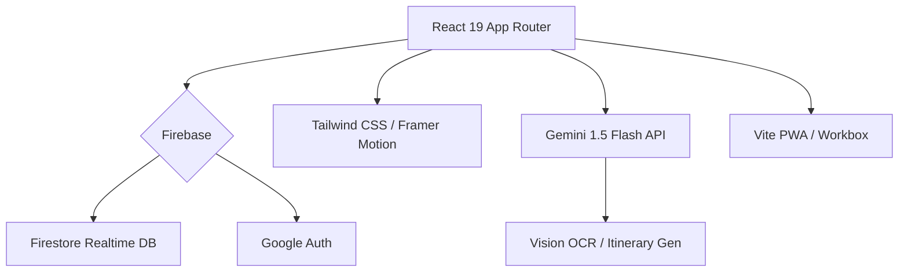

# Travel Together (智能旅遊規劃) V1.1.8

## 🚀 V1.1.8: Dark Mode & AI Polish (2025-12-23)
**V1.1.8: [Visual & Stability] Dark Mode 全面回歸 + AI 韌性強化！**
本次更新致力於極致的視覺一致性與系統穩定性。

### ✨ V1.1.8 核心更新 (Updates)
- **🌙 Dark Mode Consistency**: 統一所有 Modal (Import/Export/Create) 與 TripCard 使用 Tailwind `dark:` 變體，徹底解決深色模式切換時的視覺斷層。
- **🛡️ AI Resilience**: 針對 Gemini API 流量限制 (429) 與配額用盡情況實裝專屬偵測與用戶提示，提升 AI 功能的可靠性。
- **🖥️ UI Polish**: 修復匯出預覽區域的關閉按鈕與透明度問題，優化 JSON 預覽的代碼行號顯示。

## 🚀 V1.1.7: Daily Intelligence (2025-12-23)
**V1.1.7: [Daily Intelligence] 每日總覽智能化 + 匯出預覽升級！**
本次更新專注於「每日行程」的深度分析，引入 AI 每日總覽功能，並大幅強化匯出預覽體驗，支援全格式的全螢幕預覽。

### ✨ V1.1.7 核心更新 (Updates)
- **🧠 Daily AI Analysis**: 「每日總覽」實裝 AI 分析按鈕，一鍵生成當日交通建議、行程合理性分析與貼心 Tips (Gemini 1.5 Flash)。
- **📄 PDF Pagination**: 匯出引擎支援智能分頁，根據設定 (Items Per Page) 自動切割行程並加入頁碼。
- **👁️ Enhanced Previews**: 匯出預覽支援「JSON / Text / iCal」全螢幕放大查看 (Full View)，並優化文字顯示清晰度。
- **🐞 Core Fixes**: 修復 ai-parsing 語法錯誤及 Modal 重複代碼，提升穩定性。

## 🚀 V1.1.2: Audit & Precision (2025-12-23)
**V1.1.2: [Logic & Workflow] 全面審計與匯出精準化！**
本次更新實裝了行程匯出的「範圍選擇」(Scope)，讓你可以單獨匯出購物清單或預算記錄，不再需要強行帶上整個行程。同時引入了 AI Agent 代碼審計工作流。

## 🚀 V1.1.0: Ticket Style & Smart Connections (2025-12-21)
**V1.1.0: [Design & Intelligence] 行程管理極致進化！**
全新「票券式」卡片設計 (Ticket Style)，配備 Google Maps 實時交通預測與一鍵生成連接，讓你的旅遊規劃充滿質感。

### ✨ V1.1.0 核心更新 (Updates)
- **🎨 Ticket Style Unification**: 所有卡片統一為「機票/票券」設計，左右佈局 + 圓角裁切，極具仪式感。
- **🗺️ Google Maps Integration**: 景點間自動計算步行/交通路徑與時間，一鍵將建議加入行程。
- **🌙 Late Night Logic**: 特優化 00:00-05:00 行程排序與「返回酒店」捷徑，完美支援深夜生活。
- **🔄 Undo/Redo System**: 回復與重做功能，修改行程唔驚手殘。
- **🛡️ Dependencies Upgrade**: Firebase 11.x & Vite 6.x 安全升級。

## 🚀 V1.0.4: Optimistic UI & Data Integrity (2025-12-21)
**V1.0.4: [Optimistic UI] 極速行程管理體驗！**
引入 Optimistic UI 技術，實現「0 延遲」行程新增、編輯與刪除。即使網絡不穩，操作亦即時反饋並由後台自動同步。

### ✨ V1.0.4 核心修復 (Fixes & Features)
- **⚡ Optimistic UI**: Create/Edit/Delete 操作即時已更新 UI，無需等待 Firebase 回傳 (0ms latency)。
- **🛡️ Data Integrity**: 修復 ID 衝突漏洞，加入 LocalStorage 雙重備份，確保刷新頁面後未同步數據不丟失。
- **🗺️ Live Map Sync**: 地圖視圖與列表視圖實時同步，刪除項目後地圖 Pin 即時消失。
- **🐛 Critical Fixes**: 修復 `undefined` 字段錯誤、編輯變新增問題、刪除卡死問題。

## 🚀 V1.0.3: Immigration & PWA Matrix (2025-12-21)
**V1.0.3: [Immigration System] 入境程序全面智能化！**
專為國際航班打造的入境程序卡片，配合 Dashboard Widget 個人化系統，讓旅程管理更貼心。

---

## 🚀 V1.0.2: Zero-Loop Fix & Guest Mode (2025-12-21)
**V1.0.2: [Zero-Loop Fix] 遊客模式終極修復！**
徹底解決了遊客模式下的無限重載 (Redirect Loop) 與 WebSocket 錯誤。加入了全新的 **"Try Demo"** 入口，無需登入即可一鍵體驗完整教學模式。

### ✨ V1.0.2 核心修復 (Fixes)
- **🐛 Critical Fix**: 修復遊客模式無限 Loop 及 `null` 引用崩潰。
- **⚡️ Performance**: 清除殘留伺服器進程，解決 WebSocket 連接錯誤。
- **🛡️ Null Safety**: 全面強化 `ActiveUsersList` 與 Modals 的防錯機制。
- **🖱️ UX Upgrade**: Landing Page 新增醒目「試用模擬模式」按鈕。

## 🚀 V1.0.1: Matrix & Encyclopedia Sync (2025-12-21)
**V1.0.1: [Matrix Protocol] 最終爆發同步！**
這是一次內容與邏輯的深度同步，確保教學範例與數據結構達成 100% 匹配。我們引進了極致細節的「導航矩陣」與「全員角色任務」。

### ✨ V1.0.1 核心更新 (Updates)
- **🚀 Matrix Protocol**: 補足所有行程空檔 (如 Day 6 千日前)，達成 0 死角導航矩陣。
- **📚 Encyclopedia Content**: 深入挖掘 Senso-ji, USJ, W Osaka 等地標的建築與歷史背景。
- **👥 Per-Person Metadata**: 每一項行李、預算與購物任務均分配至具體成員。
- **🐛 Loop Bug Fix**: 徹底修復非會員無法進入教學模式的程式邏輯問題。

## 🚀 V1.0.0: The Intelligent Era (2025-12-20)
**Travel Together V1.0 正式發布！**
這是一次從 UI 到核心架構的全面進化。我們為現代多人旅遊帶來了極致流暢的體驗，集成了 **Google Gemini AI 視覺識別**、**PWA 離線模式** 與 **Design System 2.0** 玻璃擬態設計。

### ✨ V1.0 核心亮點 (Highlights)
- **🎨 Design System 2.0**: 全新 **Indigo Glass** 設計語言，採用各種深度的毛玻璃效果、微互動動畫 (Micro-interactions) 與 iOS 原生級的 Slide Up 轉場。
- **📱 Mobile First & PWA**: 完美支援 iOS/Android PWA 安裝，配備全新底部導航欄與 Safe Area 適配，離線亦可查看行程。
- **🤖 Vision-First AI**: 唔使打字！直接影相識別機票、酒店單據或收據，AI 自動填入行程表與預算分帳。
- **🛡️ Enterprise Security**: 內置 Rate Limiting (防濫用)、Autoban System (智能封鎖) 與 Firestore 自動同步，確保資料絕對安全。

---

## 📽️ 概覽 (Overview)
**Travel Together** 是一個智能化協作平台，解決傳統旅遊規劃的痛點：分散的資訊、混亂的記帳與繁瑣的輸入。

---

## 🔥 功能全覽 (Features)

### 🤖 AI 智能領隊 (AI Guide)
- **Gemini Vision**: 拖入截圖/照片，自動識別航班、酒店、景點資訊。
- **智能交通**: 自動計算點對點交通方式 (地鐵/Uber/步行)，並提供真實票價。
- **智能打包**: 根據目的地天氣與活動 (如滑雪、米芝蓮)，自動生成專屬行李清單。

### 🎨 極致體驗 (UX/UI)
- **Glassmorphism 2.0**: 現代感極強的半透明介面，適配深色模式 (Dark Mode)。
- **Skeleton Loading**: 絲滑的加載體驗，告別白屏等待。
- **Onboarding**: 新手引導模式，30 秒學會所有功能。

### 💰 財務與協作 (Budget & Collab)
- **多幣種分帳**: 即時匯率換算，支援匯出報表。
- **實時同步**: 多人同時編輯，毫秒級同步 (Firebase Realtime)。
- **債務結算**: 一鍵計算 "Who owes who"，支援匯出報表。

### 📊 旅遊資訊中心 (Info Hub)
- **實時 Widget**: 整合當地天氣、匯率、新聞、機票優惠與電壓資訊。
- **Smart Widgets**: 自動偵測你是否在旅途中，顯示當前城市資訊。

---

## 🛠️ 技術架構 (Tech Stack)

---

## 📋 版本紀錄 (History)

| 版本 | 標籤 | 狀態 |
| :--- | :--- | :--- |
| **V1.1.8** | **Dark Mode & AI Polish** | 🚀 最新版 |
| **V1.1.7** | **Daily Intelligence** | ✅ 已發布 |
| **V1.1.2** | **Audit & Precision** | ✅ 已發布 |
| **V1.1.1** | **Resilience & Polish** | ✅ 已發布 |
| **V1.0.5** | **Security Update** | ✅ 已發布 |
| **V1.0.4** | **Optimistic UI Update** | ✅ 已發布 |
| **V1.0.3** | **Immigration System** | ✅ 已發布 |
| **V1.0.2** | **Zero-Loop Fix** | ✅ 已發布 |
| **V1.0.1** | **Matrix Sync Update** | ✅ 已發布 |
| **V1.0.0** | **Official Release** | ✅ 已發布 |

---

---

## 🚀 快速開始 (Quick Start)

1. **Clone**: `git clone https://github.com/JackoV416/travelTogether2.git`
2. **Install**: `pnpm install`
3. **Setup**: 複製 `.env.example` 到 `.env`，填入 Firebase & Gemini Key
4. **Run**: `pnpm dev`
5. **Build**: `pnpm build`

---

**Author**: [Jamie Kwok](https://github.com/JackoV416)
**Last Updated**: 2025-12-23
