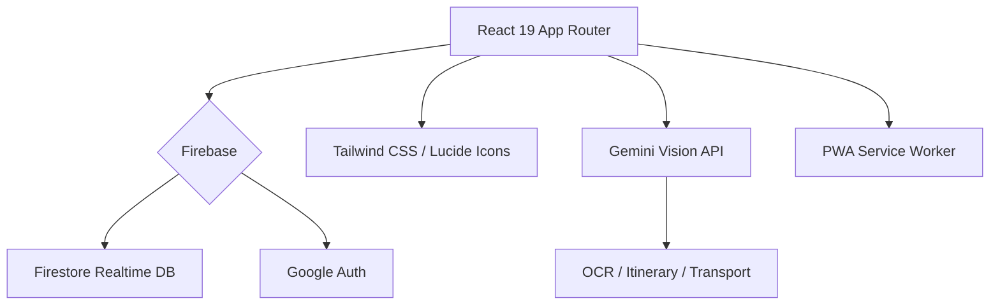

# Travel Together (智能旅遊規劃) V0.24.1

## 🚀 V0.24.1: Osaka Express Hotfix (2025-02-28)
本版本為 V0.24.0 的緊急修復更新，主要解決以下問題：
- **修復閃退**: 修正 `Loader2` 導致的天氣摘要崩潰問題。
- **API 保護**: 新增 Gemini API 限額 (429) 自動處理機制，系統更穩定。
- **體驗優化**: 優化錯誤提示 UI。

> **V0.24.0 主要功能回顧**:
> - **Smart Transport**: 長途車程精準格式化 (`X小時X分`)。
> - **Weather 2.0**: 早午晚分段天氣及洋蔥式穿搭建議。
> - **Premium UI**: Packing, Shopping, Budget, Files 四大分頁視覺全面升頻。
> - **Colors**: 全域統一行程顏色代碼。

## 🚀 最新更新: V0.24.0 "Osaka Express" (主要功能回顧)

### 🛠️ 重點修復與升級
- **[新功能] 智能交通格式**:
  - 當交通時間超過 60 分鐘時，自動轉換為「X 小時 X 分」格式，方便長途觀看。
- **[新功能] 智慧天氣摘要 2.0**:
  - 整合 Gemini 生成分時段天氣預報（早、午、晚）。
  - 提供細緻的穿著建議（如：早晚溫差大、洋蔥式穿法）。
- **[視覺升級] 頂級資訊分頁**:
  - `行李`, `購物`, `預算`, `回憶` 分頁全面翻新。
  - 加入動態進度條、類別圖標及高級 Glassmorphism 卡片效果。
- **[AI 優化] 智慧標題生成**:
  - 「AI 靈感」現在會根據你的目的地（如東京、大阪）生成具體的景點或餐廳名稱。
- **[一致性] 全域色彩同步**:
  - 統一了行程類型（景點、美食、交通等）在彈窗與列表中的視覺色系。

---

## 📽️ 概覽 (Overview)

**Travel Together** 是一個為現代旅客設計的協作平台。無論是個人獨旅還是多人成行，它都能提供從「機票解析」、「AI 行程生成」到「預算分帳」的一站式服務。

---

## ✨ 核心特色 (Key Features)

### 🤖 智能 AI 系列
- **AI 智能領隊 (V0.22.3+)**：使用真正 Gemini API 生成專屬行程規劃，區分交通模式 (地鐵/巴士/叫車)。
- **智能交通建議**：景點之間自動 AI 推薦真實交通方式、價錢及詳細路線。
- **Vision-First OCR**：圖片直接識別機票/酒店/收據資訊，跳過傳統 OCR。
- **智能打包建議**：由 AI 根據目的地活動 (行山/沙灘/高級餐飲) 與天氣，自動分類生成 6 大類清單。

### 🤝 實時協作
- **Firebase 多人同步**：毫秒級數據更新，支援 Owner/Editor 權限劃分。
- **邀請系統**：一鍵分享連結邀請旅伴。

### 💰 財務與預算
- **多幣種自動換算**：即時抓取匯率，支援雙幣顯示 (在地幣值 vs 本地幣值)。
- **精準分帳**：詳盡記錄每人支出，一鍵結算債務。

### 📤 分享與匯出
- **iCal 日曆匯出**：一鍵匯出行程到 Google/Apple 日曆。
- **WhatsApp/Telegram 分享**：快速分享行程文字給朋友。
- **多格式匯出**：JSON、純文字、PDF 報告。

### 🌆 旅遊資訊中心 (Live Hub)
- **實時追蹤**：目的地天氣預測、衣著建議、當地旅遊新聞、機票/酒店優惠。

---

## 🛠️ 技術架構 (Tech Stack)

---

## 📋 版本紀錄 (Recent Updates)

| 版本 | 主要亮點 | 狀態 |
| :--- | :--- | :--- |
| **V0.23.5** | **Osaka Grand Update**: AI 助手由實體 Vision 驅動, 教學資料全補完 (距離/步數), 港式粵語校對 | ✅ 已發布 |
| **V0.23.1** | **UI Parity**: 行程/地圖 UI 同步 AI 式樣, 分享權限強化 (可編輯), 真實教學資料 | ✅ 已發布 |
| **V0.23.0** | **Guest Preview**: 訪客預覽模式, AI 行程真實化, 導入中心實裝 | ✅ 已發布 |
| **V0.22.3** | **AI 大升級**: Gemini API, 智能交通建議, iCal 匯出, WA/TG 分享 | ✅ 已發布 |

---

## 🚀 快速開始

1. **安裝依賴**: `pnpm install`
2. **設定環境變數**: 複製 `.env.example` 到 `.env.local`，填入 API Keys
3. **啟動開發環境**: `pnpm dev`
4. **PWA 部署**: 使用 Vercel 一鍵部署，支援手機安裝。

---

**Author**: [Jamie Kwok](https://github.com/JackoV416)  
**Last Updated**: 2025-12-19 18:05 HKT
