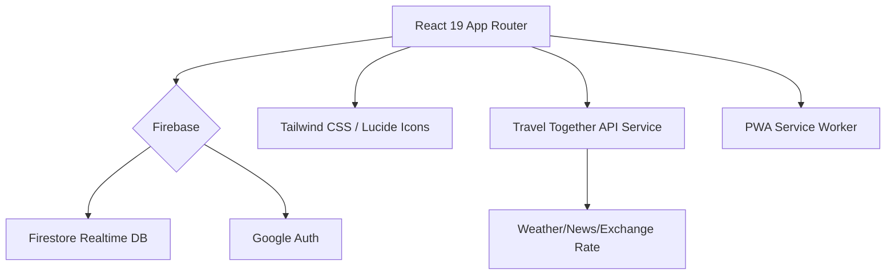

# 🌍 Travel Together 2.0
> **智能旅遊規劃與實時協作平台**  
> AI-Powered Itinerary Planner & Real-time Collaboration Tool

---

## 📽️ 概覽 (Overview)

**Travel Together** 是一個為現代旅客設計的協作平台。無論是個人獨旅還是多人成行，它都能提供從「機票解析」、「AI 行程生成」到「預算分帳」的一站式服務。

---

## ✨ 核心特色 (Key Features)

### 🤖 智能 AI 系列
- **AI 智能領隊 (V0.20.2+)**：實作時間桶 (Time Buckets) 邏輯，基於時區、天氣與偏好生成高品質行程，區分交通模式 (地鐵/巴士/叫車)。
- **智能打包建議**：由 AI 根據目的地活動 (行山/沙灘/高級餐飲) 與天氣，自動分類生成 6 大類清單。
- **機票解析功能**：上傳機票資訊自動校對 Day 1 抵達時間。

### 🤝 實時協作
- **Firebase 多人同步**：毫秒級數據更新，支援 Owner/Editor 權限劃分。
- **邀請系統**：一鍵分享連結邀請旅伴。

### 💰 財務與預算
- **多幣種自動換算**：即時抓取匯率，支援雙幣顯示 (在地幣值 vs 本地幣值)。
- **精準分帳**：詳盡記錄每人支出，一鍵結算債務。

### 🌆 旅遊資訊中心 (Live Hub)
- **實時追蹤**：目的地天氣預測、衣著建議、當地旅遊新聞、機票/酒店優惠。

---

## 🛠️ 技術架構 (Tech Stack)

---

## 📋 版本紀錄 (Recent Updates)

| 版本 | 主要亮點 | 狀態 |
| :--- | :--- | :--- |
| **V0.21.0** | **AI Evolution**: Real AI Import, 偏好矩陣, 流程優化 | 🏗️ 開發中 |
| **V0.20.2** | **Grand Evolution**: AI Time Buckets, 運輸精細化, Smart Packing 擴充, UI 拋光 | ✅ 已發布 |
| **V0.19.0** | **Premium UI**: 深色模式修正、Micro-interactions、雙幣顯示、離線 Banner | ✅ 已發布 |
| **V0.18.0** | **Smart Packing**: 行李清單分類、天氣同步校對、Add Modal 智能切換 | ✅ 已發布 |

---

## 🚀 快速開始

1. **安裝依賴**: `pnpm install`
2. **啟動開發環境**: `pnpm dev`
3. **PWA 部署**: 使用 Vercel 一鍵部署，支援手機安裝。

---

**Author**: [Jamie Kwok](https://github.com/JackoV416)  
**Last Updated**: 2024-12-18 23:45 HKT
