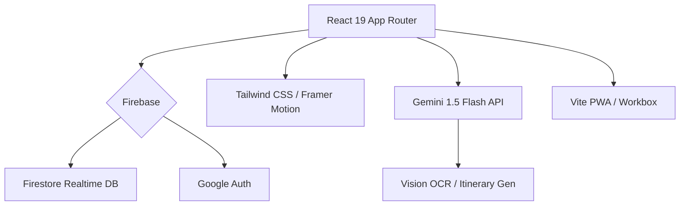

# Travel Together (智能旅遊規劃) V1.0.0

## 🚀 V1.0.0: The Intelligent Era (2025-12-20)
**Travel Together V1.0 正式發布！**
這是一次從 UI 到核心架構的全面進化。我們為現代多人旅遊帶來了極致流暢的體驗，集成了 **Google Gemini AI 視覺識別**、**PWA 離線模式** 與 **Design System 2.0** 玻璃擬態設計。

### ✨ V1.0 核心亮點 (Highlights)
- **🎨 Design System 2.0**: 全新 **Indigo Glass** 設計語言，採用各種深度的毛玻璃效果、微互動動畫 (Micro-interactions) 與 iOS 原生級的 Slide Up 轉場。
- **📱 Mobile First & PWA**: 完美支援 iOS/Android PWA 安裝，配備全新底部導航欄與 Safe Area 適配，離線亦可查看行程。
- **🤖 Vision-First AI**: 唔使打字！直接影相識別機票、酒店單據或收據，AI 自動填入行程表與預算分帳。
- **🛡️ Enterprise Security**: 內置 Rate Limiting (防濫用)、Autoban System (智能封鎖) 與 Firestore 自動同步，確保資料絕對安全。

---

## 📽️ 概覽 (Overview)
**Travel Together** 是一個智能化協作平台，解決傳統旅遊規劃的痛點：分散的資訊、混亂的記帳與繁瑣的輸入。

---

## 🔥 功能全覽 (Features)

### 🤖 AI 智能領隊 (AI Guide)
- **Gemini Vision**: 拖入截圖/照片，自動識別航班、酒店、景點資訊。
- **智能交通**: 自動計算點對點交通方式 (地鐵/Uber/步行)，並提供真實票價。
- **智能打包**: 根據目的地天氣與活動 (如滑雪、米芝蓮)，自動生成專屬行李清單。

### 🎨 極致體驗 (UX/UI)
- **Glassmorphism 2.0**: 現代感極強的半透明介面，適配深色模式 (Dark Mode)。
- **Skeleton Loading**: 絲滑的加載體驗，告別白屏等待。
- **Onboarding**: 新手引導模式，30 秒學會所有功能。

### 💰 財務與協作 (Budget & Collab)
- **多幣種分帳**: 即時匯率換算，支援「在地幣值」與「本幣」雙顯示。
- **實時同步**: 多人同時編輯，毫秒級同步 (Firebase Realtime)。
- **債務結算**: 一鍵計算 "Who owes who"，支援匯出報表。

### 📊 旅遊資訊中心 (Info Hub)
- **實時 Widget**: 整合當地天氣、匯率、新聞、機票優惠與電壓資訊。
- **Smart Widgets**: 自動偵測你是否在旅途中，顯示當前城市資訊。

---

## 🛠️ 技術架構 (Tech Stack)

---

## 📋 版本紀錄 (History)

| 版本 | 標籤 | 狀態 |
| :--- | :--- | :--- |
| **V1.0.0** | **Official Release** | 🚀 正式版 |
| **V0.27.0** | **Admin Suite**: Autoban, Rate Limits | ✅ 已發布 |
| **V0.25.0** | **Mobile First**: PWA, Bottom Nav | ✅ 已發布 |
| **V0.24.0** | **Osaka Express**: Smart Transport | ✅ 已發布 |

---

## 🚀 快速開始 (Quick Start)

1. **Clone**: `git clone https://github.com/JackoV416/travelTogether2.git`
2. **Install**: `pnpm install`
3. **Setup**: 複製 `.env.example` 到 `.env`，填入 Firebase & Gemini Key
4. **Run**: `pnpm dev`
5. **Build**: `pnpm build`

---

**Author**: [Jamie Kwok](https://github.com/JackoV416)
**Last Updated**: 2025-12-20
